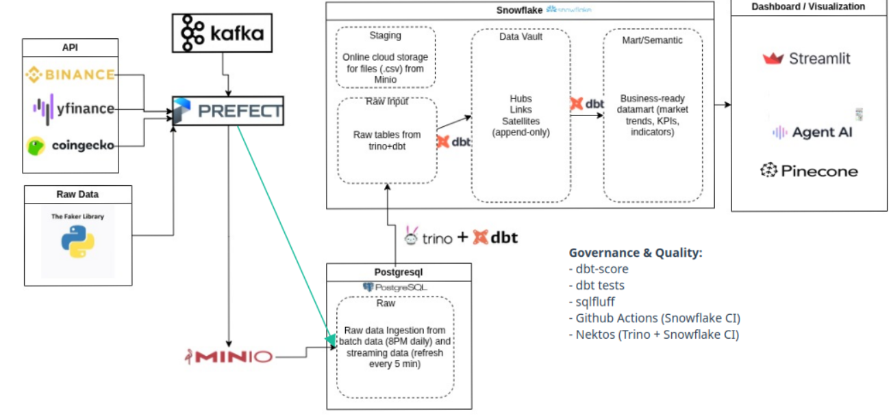

# 📊 Data Engineering Project: Stock & Crypto Data Pipeline with Snowflake

## 1. Project Overview
- **Working title**: Stock & Crypto Data Pipeline with Snowflake  
- **One-sentence summary**: A modern data engineering pipeline to collect, store, transform, and visualize stock and top 50 cryptocurrency data.  
- **Business/value objective**: Provide real-time and historical insights into stock and crypto markets for analytics, research, and decision-making.  
- **Success metrics (quantitative)**:  
  - Collect and store historical and real-time data for 50 cryptocurrencies and selected stocks  
  - Transform and load datasets into Snowflake with minimal latency (<1h for batch updates)  
  - Generate Streamlit dashboards with AI agent

---

## 2. Problem & Scope
- **Problem statement and constraints**:  
  Financial analysts and crypto enthusiasts lack a unified platform that consolidates multiple stock and cryptocurrency sources in a structured and actionable format. The system should handle both batch and streaming data with automated transformation pipelines.  
- **Personas/stakeholders and primary use cases**:  
  - Data analysts monitoring crypto and stock trends  
  - Quantitative researchers performing technical analysis  
  - Business users visualizing KPIs and indicators via dashboards  
- **In/out of scope**:  
  - **In scope**: Real-time data ingestion, batch ingestion, data transformation, technical indicators, dashboards, AI agent answering simple ad-hoc questions  
  - **Out of scope**: High-frequency trading, private exchange APIs, predictive AI modeling (beyond ad-hoc queries)

---

## 3. Data Sources
- **Batch source(s)**:  
  - **Faker Library**: Generates synthetic transaction data (personal and corporate customers, transactions, demographics)
  - **Karpet API**: Cryptocurrency news articles
- **Real-time source(s)**:  
  - **Binance API**: 24-hour cryptocurrency ticker statistics
  - **CoinGecko API**: Current cryptocurrency market prices and volumes
  - **yfinance API**: Stock prices and cryptocurrency prices
  - **FreeCryptoAPI**: Generic cryptocurrency price API
  - **Kafka**: Real-time transaction streaming from Kafka topics
- **Incremental strategy**:  
  - **Batch**: Daily ingestion of CSV files into MinIO, then staged to Snowflake  
  - **Streaming**: Kafka consumers load data into raw tables, processed by incremental dbt flows every 5 minutes  

---

## 4.1 High-Level Architecture
- **Diagram link or embed placeholder**:  
    
- **Components**:  
  - **Data Ingestion**: Faker (synthetic data), Karpet API (news), Binance/CoinGecko/yfinance/FreeCryptoAPI (prices), Kafka (streaming)
  - **Data Lake**: MinIO (S3-compatible) for raw CSV files  
  - **Data Warehouse & Transformation**: Snowflake + dbt for cleaning and transformation, Trino for federated queries
  - **Streaming**: Kafka + ZooKeeper for real-time ingestion  
  - **Data Orchestration**: Prefect v3 for scheduling ETL pipelines (4 main flows)
  - **Vector Database**: Pinecone for RAG (document embeddings)
  - **Visualization**: Streamlit dashboards with AI chatbot
  - **Intermediate Storage/Testing**: PostgreSQL (TimescaleDB) + pgAdmin  
  - **Observability**: Prometheus + Grafana for monitoring
- **Data flow**:  
  1. Ingest batch data (fake transactions, news, prices) via Prefect flows  
  2. Stage raw data in MinIO object storage  
  3. Load from MinIO to Snowflake stage, then into raw tables  
  4. Transform data via dbt (runs on both Trino and Snowflake targets)
  5. Process Kafka streaming data with incremental dbt every 5 minutes
  6. Serve visualizations and AI agent queries via Streamlit

### AI Chatbot Features
The project includes a production-quality AI chatbot (`scripts/chatbot/`) with:
- **LangGraph**: Graph-based agent workflow for multi-step reasoning
- **Tesseract OCR**: Image-to-text extraction for ID cards and documents
- **Pinecone RAG**: Document search using vector embeddings
- **Snowflake Integration**: Query warehouse tables for historical data
- **Streamlit UI**: Interactive chat interface with conversation history

## 4.2 Data Modeling
The data modeling for this project uses **Data Vault 2.0** methodology with dbt, following a layered architecture: Raw → Data Vault → Marts → Semantic.

### Raw Layer (`models/raw_sf/`)
Raw models that reference source tables in Snowflake:
- `raw_customers.sql`
- `raw_corporates.sql`
- `raw_transaction_personal.sql`
- `raw_transaction_corporate.sql`
- `raw_news.sql`
- `raw_cryptoprices_binance.sql`, `raw_cryptoprices_coingecko.sql`, `raw_cryptoprices_yfinance.sql`
- `raw_stockprices_yfinance.sql`

### Data Vault Layer (`models/warehouse/`)
Data Vault 2.0 models implementing the hub-link-satellite pattern:

**Hubs** (Business Keys):
- `hub_customer.sql` - Customer business keys
- `hub_company.sql` - Company business keys
- `hub_asset.sql` - Asset business keys (crypto and stocks)
- `hub_transaction.sql` - Transaction business keys
- `hub_news.sql` - News article business keys

**Links** (Relationships):
- `link_customer_transaction.sql` - Customer to transaction relationships
- `link_company_transaction.sql` - Company to transaction relationships
- `link_customer_company.sql` - Customer to company relationships
- `link_transaction_asset.sql` - Transaction to asset relationships
- `link_news_asset.sql` - News to asset relationships

**Satellites** (Descriptive Attributes):
- `sat_customer_profile.sql` - Customer attributes (tier, risk tolerance, demographics)
- `sat_company_details.sql` - Company attributes
- `sat_transaction_personal.sql` - Personal transaction details
- `sat_transaction_corp.sql` - Corporate transaction details
- `sat_asset_price_crypto.sql` - Cryptocurrency price attributes
- `sat_asset_price_stock.sql` - Stock price attributes
- `sat_news_content.sql` - News article content

### Mart Layer (`models/marts/`)
Dimensional models for analytics and reporting:

**Dimension Tables:**
- `dim_customer.sql` - Current customer dimension
- `dim_customer_history.sql` - Historical customer dimension (SCD Type 2)
- `dim_asset.sql` - Asset dimension (crypto and stocks)
- `dim_company.sql` - Company dimension

**Fact Tables:**
- `fct_transactions.sql` - Main transaction fact table
- `fct_asset_prices.sql` - Asset price fact table
- `fct_news_events.sql` - News events fact table
- `fct_asset_price_comparison.sql` - Price comparison across sources
- `fct_asset_news_impact.sql` - News impact on asset prices

### Semantic Layer (`models/semantic/`)
Business-friendly semantic models for end-user queries:
- `semantic_transactions.sql` - Transaction semantic view
- `semantic_customer_overview.sql` - Customer overview semantic view
- `semantic_asset_performance.sql` - Asset performance semantic view

### Key Fact Table: `fct_transactions`
The `fct_transactions` table is the main fact table in the data warehouse, built from Data Vault structures. It contains:
- Transaction identifiers (transaction_hk, transaction_id)
- Customer and company relationships (customer_hk, company_hk)
- Asset information (asset_hk, asset_symbol, asset_type)
- Transaction details (transaction_type, quantity, price_per_unit, transaction_amount, fee_amount)
- Customer attributes (tier, risk_tolerance, country)
- Asset attributes (asset name, category, market cap)
- Time dimensions (transaction_timestamp, date dimensions)
- Calculated metrics (net_amount, fee_percentage)
- Data quality and lineage information

---

## 4.3 Prefect Flows

The project uses Prefect v3 for workflow orchestration. Four main flows are deployed:

1. **batch-data-pipeline**: Daily at 8:00 PM
   - Generates fake transaction data (customers, corporates, transactions)
   - Scrapes cryptocurrency news from Karpet API
   - Loads data to MinIO, Snowflake, and PostgreSQL
   - Runs dbt transformations

2. **prices-crypto-pipeline**: Daily at 8:00 PM
   - Fetches cryptocurrency prices from Binance, CoinGecko, yfinance, and FreeCryptoAPI
   - Loads to MinIO, Snowflake stage, and PostgreSQL

3. **prices-stock-pipeline**: Daily at 8:00 PM
   - Fetches stock prices from yfinance
   - Loads to MinIO, Snowflake stage, and PostgreSQL

4. **trino-incremental-dbt-5min**: Every 5 minutes
   - Processes Kafka-consumed raw tables (raw_customers, raw_corporates, raw_transactions)
   - Runs dbt transformations on both Trino and Snowflake targets

For detailed documentation on each flow, see [`docs/prefect_flows.md`](docs/prefect_flows.md).

---

## 4.4 Docker Setup
The project uses Docker to orchestrate the different services. The `docker-compose.yml` file defines the following services:

- **timescaledb**: A PostgreSQL database with the TimescaleDB extension for time-series data.
- **prefect_db**: A PostgreSQL database for the Prefect orchestration tool.
- **pgadmin**: A web-based administration tool for PostgreSQL.
- **minio**: An S3-compatible object storage server for the data lake.
- **kafka**: Apache Kafka for event streaming.
- **zookeeper**: Apache ZooKeeper for Kafka coordination.
- **trino**: Distributed SQL query engine for federated queries.
- **prometheus**: Metrics collection and monitoring.
- **grafana**: Metrics visualization and dashboards.
- **prefect**: The Prefect server for orchestrating the data pipelines.

To run the services, you can use the following command:
```bash
docker-compose up -d
```

---

## 4.5 Documentation
The project includes the following documentation:

- **Architecture & Decisions**:
  - `docs/decisions/decision_log.md`: Architecture Decision Record (ADR) documenting all technology choices
  - `docs/architecture/`: Architecture diagrams

- **Prefect Flows**:
  - `docs/prefect_flows.md`: **Comprehensive documentation of all 4 Prefect flows** - schedules, data sources, destination tables, and flow steps

- **Setup & Guides**:
  - `docs/steps_by_steps.md`: Step-by-step guide for the project
  - `docs/ERD/`: Entity Relationship Diagrams and Physical Data Models

- **Chatbot** (in `scripts/chatbot/`):
  - `README_CHATBOT.md`: AI chatbot system documentation
  - `troubleshoot_tessaract.md`: Quick start guide for the tessaract
  - `chatbot_checklist.md`: checklist of chatbot requirements coverage

---

---

## 5. Implementation Milestones
- **Milestone 0**: Week 0-3 Docker setup, TimescaleDB working, basic API data ingestion ✅
- **Milestone 1**: Week 4-6 Load one large historical dataset into MinIO and then into TimescaleDB ✅
- **Milestone 2**: Week 7-9 Create dbt models for the fact table and one continuous aggregate. Ability to use Prefect as data orchestration, incremental updates ✅
- **Milestone 3**: Week 10-12 Streamlit dashboard showing a working candlestick chart from TimescaleDB ✅
- **Milestone 4**: Week 13-16 Kafka streaming ✅
- **Milestone 5**: Week 17-Tet 2026 Snowflake integration, AI agent, final features ✅
  - ✅ Snowflake integration with dbt transformations
  - ✅ AI chatbot with LangGraph, Tesseract OCR, Pinecone RAG
  - ✅ Four Prefect flows deployed and scheduled
  - ✅ Observability with Prometheus and Grafana

test CI
## 6. Detailed plan and estimated timelapse
**Milestone 0**:  
*0.1. Goal: Working Database*
0.1.1	Create Docker Compose: Define services for Postgres (TimescaleDB) and pgAdmin. ***1 day***  
0.1.2	Start & Test: Run docker-compose up. Connect pgAdmin to Postgres.	***1/2 day***  
0.1.3	Enable TimescaleDB: Run CREATE EXTENSION IF NOT EXISTS timescaledb CASCADE; in your database.	***1/4 day***  
0.1.4	Create Core Tables: Define the dim_ticker and fact_daily_price tables (the 2 most essential). Do NOT make fact_daily_price a hypertable yet.	***1 day***  
0.1.5	Commit: Get core Docker and database schema on Git.


*0.2. Goal: First Data Row*  
0.2.1	Add Python Ingestion Service: Update docker-compose.yml to include a Python service (where your scripts run).	***1 day***  
0.2.2	Write a Single Python Script (ingest_test.py): Use the yfinance API to fetch the last 7 days of data for one ticker (e.g., 'AAPL').	***1 day***  
0.2.3	Connect to TimescaleDB: Use psycopg2 or SQLAlchemy in your script to connect to the database container.	***1/2 day***  
0.2.4	Insert Test Data: Write a loop to insert the 'AAPL' data into your non-hypertable fact_daily_price table. (Your First End-to-End Test)	***1 day***  
0.2.5	Commit: Successfully inserted data visible in pgAdmin.  

*0.3. Goal: Hypertable & MinIO integration*  
0.3.1	Convert to Hypertable: Run SELECT create_hypertable('fact_daily_price', 'time');.	***1/4 day***  
0.3.2	Add MinIO to Docker: Update docker-compose.yml for MinIO (Data Lake) and its GUI tool (e.g., MinIO Client or Console).	***1 day***  
0.3.3	Write MinIO Upload Script: Modify your Python script to save the raw yfinance data (CSV/Parquet) into a MinIO bucket before inserting it into TimescaleDB.***1 day***  
0.3.4	Commit: Raw data landing in MinIO, cleaned data landing in TimescaleDB hypertable.  
uv run --env-file .env dbt debug
## 7. Folder structure
```
.
├── .env                  # Environment variables for services
├── docker-compose.yml    # Defines all services (TimescaleDB, MinIO, Kafka, etc.)
├── pyproject.toml       # Python dependencies (using uv)
├── prefect.yaml         # Prefect deployment configurations
├── dbt_project.yml      # dbt project configuration
├── README.md

├── data/                 # Local data directory (CSV outputs)
│   └── *.csv            # Generated CSV files with timestamps

├── seeds/                # Static data for dbt
│   ├── stocklist.txt    # Stock ticker symbols
│   ├── cryptolist.txt   # Cryptocurrency symbols
│   └── asset_info.csv   # Asset metadata

├── scripts/              # Python application code
│   ├── data_generation/ # Data generation and ingestion scripts
│   │   ├── a1_1_raw_data_faker_generator.py    # Fake transaction data
│   │   ├── a1_2_news_data_scrapper.py          # Crypto news scraper
│   │   ├── a1_3_batch_data_to_s3.py            # Upload to MinIO
│   │   ├── a1_4_batch_s3_to_snowflake.py       # Load to Snowflake
│   │   ├── a2_*_crypto_*.py                    # Crypto price sources
│   │   ├── a3_*_stock_*.py                     # Stock price sources
│   │   └── b1_1_trino_incremental_dbt.py       # Incremental dbt flow
│   ├── flow/             # Prefect flow orchestrators
│   │   ├── flow__batch_data_s3_snowflake.py
│   │   ├── flow__prices_data_s3_snowflake.py
│   │   └── flow__stock_prices_data_s3_snowflake.py
│   ├── chatbot/          # AI chatbot application
│   │   ├── chatbot_app.py          # Streamlit UI
│   │   ├── chatbot.py               # LangGraph agent
│   │   ├── ocr_tools.py             # Tesseract OCR
│   │   ├── warehouse_tools.py       # Snowflake queries
│   │   └── document_processor.py    # Pinecone RAG
│   ├── kafka/            # Kafka producer/consumer scripts
│   ├── dbt/               # dbt utility scripts
│   └── utils/             # Reusable helper functions
│       ├── snowflake_connector.py
│       ├── minio_connector.py
│       └── date_utils.py

├── models/                # dbt SQL models
│   ├── raw_sf/           # Raw Snowflake models
│   ├── warehouse/        # Data warehouse models
│   ├── marts/            # Mart models (fact/dim tables)
│   └── semantic/         # Semantic layer models

├── macros/                # dbt macros (reusable SQL)
├── tests/                 # dbt tests
├── docs/                  # Project documentation
│   ├── prefect_flows.md  # Prefect flows documentation
│   ├── decisions/        # Architecture Decision Records
│   └── architecture/     # Architecture diagrams

├── docker/                # Docker configurations
│   ├── kafka-producer/
│   ├── kafka-consumer/
│   ├── postgres/
│   └── trino/

├── grafana/               # Grafana dashboard configurations
├── prometheus/            # Prometheus configuration
└── profiles/              # dbt profiles configuration
```